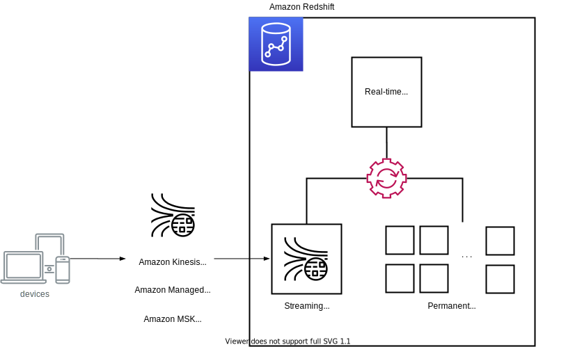

# Amazon Redshift - Getting started with Streaming ingestion

This is a collecton of CDK projects to show how to load data from streaming services into Amazon Redshift.

### Streaming ingestion from

 * [Amazon Kinesis Data Streams](./from-kinesis/)
 * [Amazon Managed Streaming for Apace Kafka (MSK)](./from-msk/)
 * [Amazon MSK Serverless](./from-msk-serverless/)

### References
 * [Amazon Redshift - Getting started with streaming ingestion from Amazon Kinesis Data Streams](https://docs.aws.amazon.com/redshift/latest/dg/materialized-view-streaming-ingestion-getting-started.html)
 * [Amazon Redshift - Getting started with streaming ingestion from Amazon Managed Streaming for Apache Kafka](https://docs.aws.amazon.com/redshift/latest/dg/materialized-view-streaming-ingestion-getting-started-MSK.html)
* [Real-time analytics with Amazon Redshift streaming ingestion (2022-04-27)](https://aws.amazon.com/ko/blogs/big-data/real-time-analytics-with-amazon-redshift-streaming-ingestion/)
* [Easy analytics and cost-optimization with Amazon Redshift Serverless (2022-08-30)](https://aws.amazon.com/ko/blogs/big-data/easy-analytics-and-cost-optimization-with-amazon-redshift-serverless/)
* [Amazon Redshift Features Workshop](https://catalog.us-east-1.prod.workshops.aws/workshops/7782379f-2424-4a03-be55-ea7dc1a1c353/en-US)

## Security

See [CONTRIBUTING](CONTRIBUTING.md#security-issue-notifications) for more information.

## License

This library is licensed under the MIT-0 License. See the LICENSE file.

